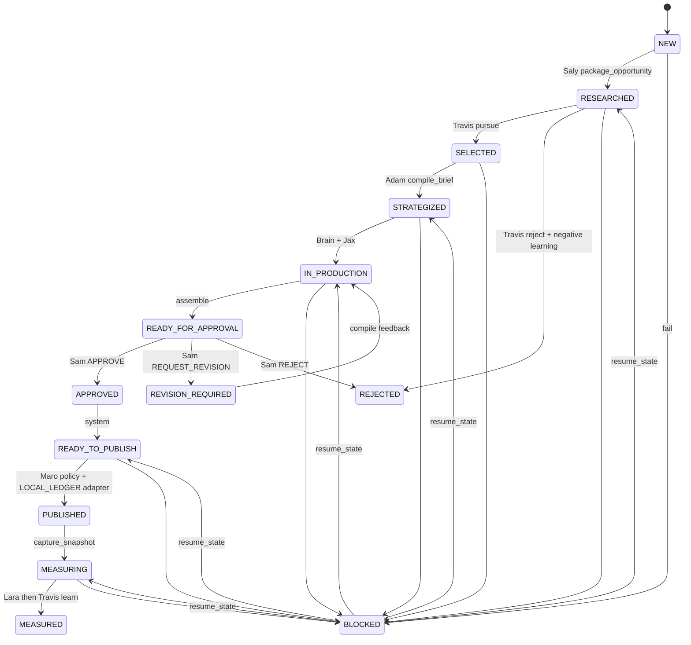

# Slice V1 — Kernel loop (frozen)

Status: **approved for implementation on `slice/kernel-loop`**. Do not implement on `main`.

Amendments locked 2026-09-13:

1. Intended platform (`LINKEDIN`) is separate from execution adapter (`LOCAL_LEDGER`).
2. `BLOCKED` resumes from recorded `resume_state`, never semantically to `NEW`.
3. Travis rejection **must** persist a negative `LEARNING_RECORD`.
4. Telemetry kinds: `MODEL_RUN` | `CAPABILITY_RUN` | `ADAPTER_RUN` | `POLICY_CHECK`. Only Brain may create a model run in this slice.
5. Default observe quality = `UNAVAILABLE`. Synthetic `COMPLETE` is tests-only and must set `mocked: true`.

## Outcome

`RESEARCH_SIGNAL → OPPORTUNITY → DECISION+ASSIGNMENT → BRIEF → DRAFT + NO_VISUAL_REQUIRED → PACKAGE → Sam APPROVAL → Execute (LOCAL_LEDGER) → Observe → Learn → next work item consumes learning`

Seven roles remain ownership/projection boundaries. Implementations may be deterministic, model-backed, adapter, or policy.

## Canonical states

`NEW → RESEARCHED → SELECTED → STRATEGIZED → IN_PRODUCTION → READY_FOR_APPROVAL → APPROVED → READY_TO_PUBLISH → PUBLISHED → MEASURING → MEASURED`

Also: `REVISION_REQUIRED`, `REJECTED`, `BLOCKED`, `CANCELLED`.

`BLOCKED` always stores `resume_state`. Resume restores that state, not `NEW`.
`resume_state` must be non-null and must not be `NEW` or `BLOCKED`.
Continue recovery order:

1. valid stored `resume_state`
2. durable artifact + execution evidence (last completed stage / missing next artifact)
3. `blocked_reason` heuristic
4. otherwise remain BLOCKED with an explicit non-recoverable reason

Do not map an unknown BLOCKED row to `STRATEGIZED` just because `blocked_reason` was overwritten to `BLOCKED is missing resume_state`.
Example: `CONTENT_BRIEF` exists, Brain execution failed, no `CONTENT_DRAFT` → repair to `STRATEGIZED` and retry Brain only.

Examples:

- Brain schema/JSON failure → `resume_state=STRATEGIZED`
- Publish adapter transient failure → `resume_state=READY_TO_PUBLISH`
- Policy/approval problem → `resume_state=READY_TO_PUBLISH` until condition corrected

## Platform vs adapter

| Field | Value in this slice | Meaning |
|---|---|---|
| `intended_platforms` | `["LINKEDIN"]` | Public surface Adam/Brain/Jax prepare for |
| `execution_target` | `LOCAL_LEDGER` | Runtime adapter binding |

A future LinkedIn adapter replaces `execution_target` only.

## Capabilities

| id | owner | kind | model? |
|---|---|---|---|
| package_opportunity | saly | CAPABILITY_RUN | no |
| prioritize_and_assign | travis | CAPABILITY_RUN | no |
| compile_brief | adam | CAPABILITY_RUN | no |
| write_public_copy | brain | MODEL_RUN (live) / CAPABILITY_RUN (content-preserving test double) | live only |
| decide_creative | jax | CAPABILITY_RUN | no |
| assemble_package | system | CAPABILITY_RUN | no |
| record_approval | sam/system | POLICY_CHECK | no |
| validate_and_publish | maro | POLICY_CHECK then ADAPTER_RUN | never |
| capture_snapshot | system | ADAPTER_RUN | no |
| interpret_performance | lara | CAPABILITY_RUN | no |
| decide_next_cycle | travis | CAPABILITY_RUN | no |
| compile_revision | system | CAPABILITY_RUN | no |

Jax always emits `NO_VISUAL_REQUIRED` in this slice. That is Jax ownership, not a skipped role.

## Learning

Append-only `LEARNING_RECORD` + `learning_records` table.

Travis `reject` **must** write a negative record (`cycle_decision=STOP`) with `opportunity_fingerprint` so the next item cannot rediscover the same opportunity blindly.

Next item: `LEARNING_CONTEXT` from last 10 records + fingerprint matches. Travis rejects when fingerprint matches a `STOP` record.

## Observe

Default `data_quality=UNAVAILABLE`. Lara → `NEED_MORE_DATA`, no causal claims, no invented metrics.

Tests may set COMPLETE only with `mocked: true` and provenance `LOCAL_ADAPTER_SYNTHETIC`.

## Live Brain generation

Brain is the only model hop. The live Ollama path must:

- send a compact CONTENT_DRAFT JSON schema via `format` (structured output), not the full Brain contract dump
- use `num_predict=2048` (`BRAIN_MAX_OUTPUT_TOKENS`), not 768
- record `done_reason`, `eval_count`, `prompt_eval_count`, and `response_len` on failure
- treat truncated/malformed JSON as BLOCKED (`resume_state=STRATEGIZED`)
- never use schema-fixture recovery or `MOCK_PROVIDER` as success

## Out of slice

Neural Core, OAuth, real social APIs, extra employees, unrelated refactors.

## Acceptance tests (this slice)

These tests must prove a real loop, not fixture-complete success:

- `signal_survives_the_chain`
- `assignment_binds_opportunity`
- `travis_is_not_fixture_assignment`
- `jax_owns_no_visual`
- `maro_zero_llm`
- `execute_writes_receipt`
- `observe_unavailable_is_honest`
- `lara_no_causality_when_unavailable`
- `learning_crosses_work_items`
- `travis_reject_persists_negative_learning`
- `brain_invalid_json_blocks`
- `stale_approval_is_rejected`
- `revision_feedback_reaches_brain`
- `approval_gate_unchanged`
- `pause_and_restart_preserve_state`
- `schema_fixture_not_used_as_success`
- `publish_adapter_failure_resumes_ready_to_publish`
- `live_style_provider_json_error_resumes_strategized`
- `missing_resume_state_is_repaired_without_blocked_to_blocked`
- `overwritten_resume_error_recovers_from_brief_and_failed_brain`
- `unknown_blocked_row_stays_blocked_without_guessing_strategized`
- `truncated_json_is_not_recovered`

